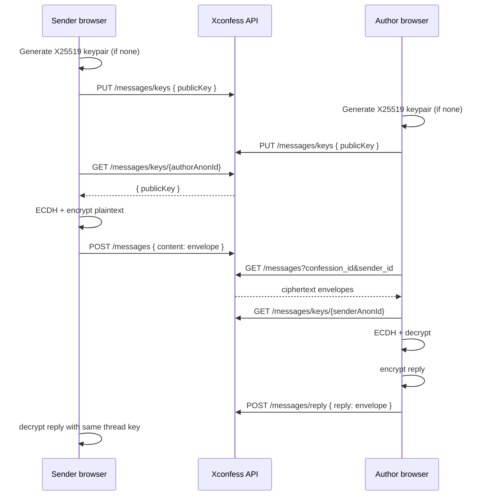

# End-to-End Encrypted Private Messaging

This document describes the E2E encryption protocol for Xconfess anonymous direct messages (issue #1340).

## Threat model

| Actor | Can read message plaintext? |
|-------|----------------------------|
| Server / DB breach | **No** — only ciphertext envelopes are stored |
| Network observer (TLS terminated) | **No** — ciphertext in transit |
| Other users | **No** — without thread keys |
| Participant with valid private key | **Yes** |
| Participant who lost private key (no backup) | **No** — by design |

The server never receives private keys. Public keys are published per anonymous session identity.

## Cryptographic design

### Identity keys

Each anonymous session identity (`anonymous_user`) has an **X25519 key pair**:

- **Private key**: generated in the browser, stored in **IndexedDB** (`xconfess-message-keys`).
- **Public key**: registered via `PUT /api/messages/keys`.

### Thread key derivation

A conversation thread is identified by:

```
threadId = "{confessionId}:{senderAnonymousUserId}"
```

Both the confession author and the message sender derive the same AES-256-GCM key:

```
sharedSecret = X25519(myPrivateKey, peerPublicKey)
salt         = SHA-256(threadId)
threadKey    = HKDF-SHA256(sharedSecret, salt, info="xconfess-e2e-v1", length=256)
```

### Ciphertext envelope

Stored in `messages.content` and `messages.replyContent`:

```json
{
  "v": 1,
  "alg": "aes-256-gcm",
  "iv": "<base64url 12-byte nonce>",
  "ct": "<base64url ciphertext + auth tag>"
}
```

The API rejects plaintext bodies for create/reply operations.

## Key exchange flow



## Key storage and recovery

### Default (device-bound)

Private keys live in IndexedDB. Clearing site data or switching browsers generates a **new** key pair on next visit. Old messages become unreadable unless a backup exists.

### Optional passphrase backup

Users may save a recovery passphrase:

1. Client wraps the private key with **PBKDF2-SHA256** (310k iterations) + **AES-256-GCM**.
2. Wrapped blob uploaded via `PUT /messages/keys` as `encryptedKeyBackup`.
3. Server stores the blob but **cannot decrypt** it.

Restore on a new device:

1. `GET /api/messages/keys/backup`
2. User enters passphrase → unwrap private key → save to IndexedDB

## Edge cases

### New device, no backup

- A fresh key pair is generated and registered (`messageKeyVersion` increments if public key changes).
- **Historical messages remain ciphertext** — the UI shows: `[Unable to decrypt — wrong device or missing recovery key]`.
- New messages work after both parties fetch the new public keys.

### New device, with backup

- User restores via passphrase before reading threads.
- Same private key → all historical thread messages decrypt normally.

### Peer has not registered a key yet

- `GET /messages/keys/{id}` returns **404**.
- Send is blocked until the recipient opens Messages (or any flow that registers keys).

### Key rotation

- Registering a different `publicKey` for the same anonymous identity increments `messageKeyVersion`.
- Messages encrypted to an older key remain decryptable only with the matching private key.

### Notifications

- Email/push previews use the constant `[Encrypted message]` — no plaintext leaks server-side.

## API reference

| Method | Path | Description |
|--------|------|-------------|
| `PUT` | `/api/messages/keys` | Register session public key (+ optional backup) |
| `GET` | `/api/messages/keys/me` | Current session key status |
| `GET` | `/api/messages/keys/backup` | Download wrapped private key backup |
| `GET` | `/api/messages/keys/:anonymousUserId` | Fetch participant public key |

## Tests

- **Unit**: `xconfess-backend/src/messages/crypto/message-e2e.crypto.spec.ts` — ECDH, encrypt/decrypt, tampering, backup wrap/unwrap, lost-key simulation.
- **E2E**: `xconfess-backend/test/message-e2e-key-exchange.e2e-spec.ts` — key registration, encrypted send/reply through the HTTP layer.

Run:

```bash
npm run test --workspace=xconfess-backend -- message-e2e
```

## Implementation files

| Area | Path |
|------|------|
| Crypto (server reference) | `xconfess-backend/src/messages/crypto/message-e2e.crypto.ts` |
| Key API | `xconfess-backend/src/messages/message-keys.service.ts` |
| Client crypto | `xconfess-frontend/app/lib/crypto/messageE2E.ts` |
| Client key store | `xconfess-frontend/app/lib/crypto/messageKeyStore.ts` |
| React hook | `xconfess-frontend/app/lib/hooks/useMessageE2E.ts` |
